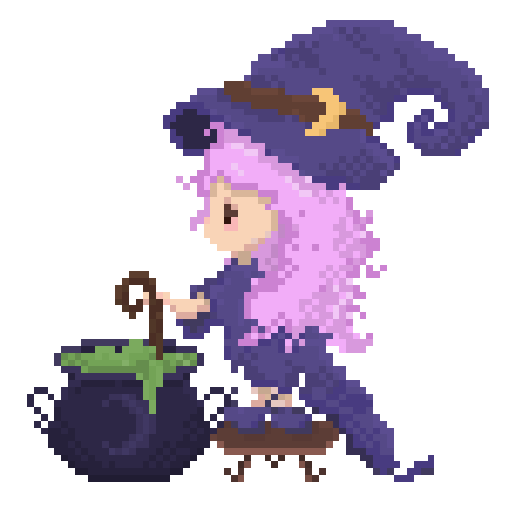
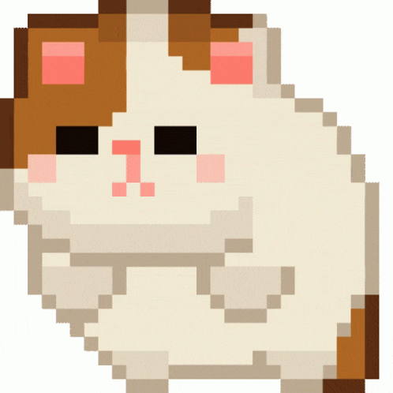

<!-- HERO SECTION -->

<table>
  <tr>
    <td>

# 🌙 Hi! I’m Joss — Full-stack web dev and designer

### Software development student blending full-stack engineering with visual design — currently exploring machine learning and cybersecurity (✿◠‿◠).

<i>I design. I build. I care about the invisible architecture behind things.</i>
 

  </td>
  <td>
    
  </td>
  </tr>
</table>

---

## ✦ Tech Stack

<table align="center">
  <tr>
    <td width="50%" valign="top" align="center">

### 🕯️ Design

   </td>
   <td width="50%" valign="top" align="center">

### 🌿 Frontend

   </td>
  </tr>

  <tr>
    <td width="50%" valign="top" align="center">

### 🔮 Backend

   </td>
   <td width="50%" valign="top" align="center">

### 🧷 Tools & Workflow

  </td>
  </tr>
</table>

---

## 🔮 Featured Projects

<table>
  <tr>
    <td width="50%" valign="top">

### 🕯️ [VITALIA: Your Wellness Company](https://vitalia-selfcare.vercel.app)

A full-stack web application designed to deliver personalized wellness recommendations.

<strong style="color:#B57EDC;">Solution:</strong> Implemented authentication flows, built a recommendation API (<code>vitalia-core</code>), and designed the complete UI/UX experience.  

</td>
<td width="50%" valign="top">

### 🌿 POSDATA STUDIO (in progress)

Website and digital presence for my own web development & design studio.

<strong style="color:#B57EDC;">Goal:</strong> Build a cohesive identity that blends storytelling, aesthetics, and technical clarity.  
  
   </td>
  </tr>
</table>

---

## ☾ Let’s Connect

<table>
  <tr>
    <td align="left">
      
    </td>
    <td>

If you're building something meaningful, I’d love to be part of it.

- **Email**: [marsalahjosefina@gmail.com](mailto:marsalahjosefina@gmail.com)  
- **LinkedIn**: [Josefina Marsala](https://www.linkedin.com/in/josmarsala/)

    </td>
  </tr>
</table>
